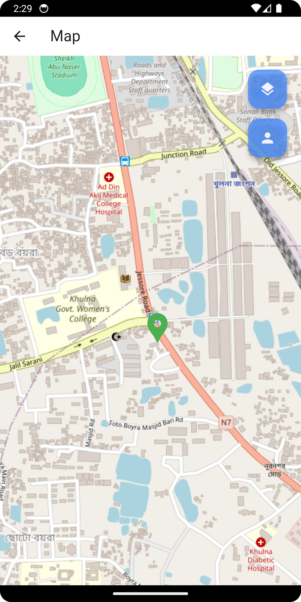

# OSM Location Finder

This Flutter application allows users to input a location, such as a city name, address, or
coordinates, to display a map of the specified area.

## Features

- Input location by city name, address, or coordinates.
- View the corresponding map for the entered location.

# Project Setup Process

flutter pub get

flutter run

that's it then you can run the project.

# Video Preview of project setup and run

## You can watch project setup and run video [click here](https://drive.google.com/file/d/1JqF-XgXv7SB6vGpwbDJiUzXeb8sMBvH6/view?usp=drive_link)

# Screenshot of two screen

